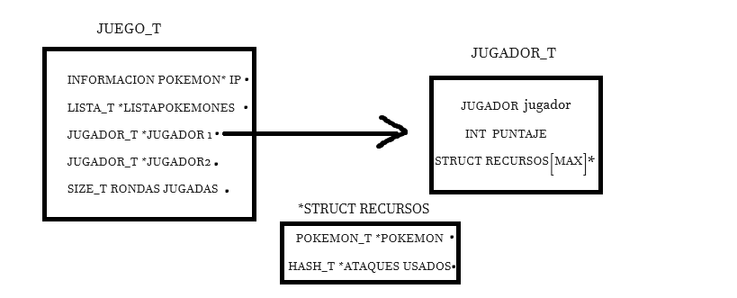
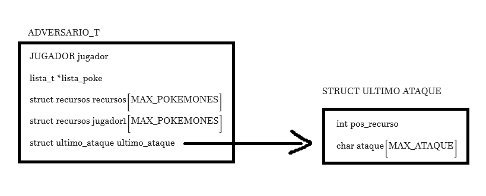
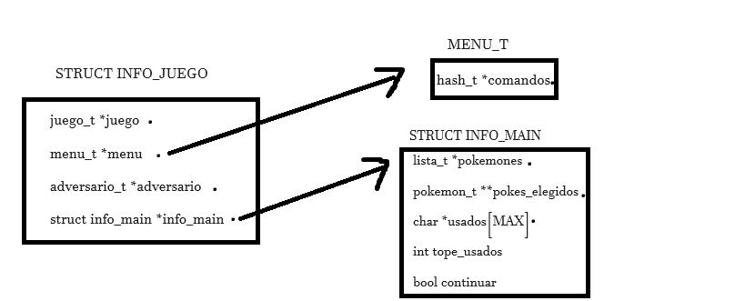

TP2

## Repositorio de Facundo Lescano - 110784 - flescano@fi.uba.ar

- Para compilar:

```bash
make pruebas_chanutron
make main

```

- Para ejecutar:

```bash
./main
./pruebas_chanutron
```

- Para ejecutar con valgrind:
```bash
valgrind ./main
valgrind ./pruebas_chanutron
make valgrind-main
make valgrind-chanutron
```
---
##  Funcionamiento

La lógica de este TP fue basada en los contratos establecidos tanto de normas de juego como de implementaciones. Para poder llevar a cabo la implementación usé para cada jugador un vector de structs que contiene un Pokémon y un hash con los ataques usados, esto me facilitó a la hora de realizar jugadas y chequear la disponibilidad de cada ataque. Use esta implementación ya que me parecía adecuado el fácil acceso para saber si un ataque estaba usado, ya que para validar la información brindada por el usuario debía buscar tanto el Pokémon como el ataque que habia elegido, y eso ya me facilitaba tanto la posición en el vector del Pokémon que contenía ese ataque y el hash de ataques usados donde luego debía insertar su jugada.


Las estructuras utilizadas fueron dos para jugador, tres para adversario y dos en común para cada uno.

Las estructuras en común son aquellas que usan tanto jugador como adversario. La primera es de recursos, llamada asi ya que cuenta con un puntero a Pokémon y un hash de ataques usados ya que tendra un fácil acceso a la hora de chequear ataques disponibles.
La segunda estructura es ataque_cargar que fue utilizada para verificar cada jugada del jugador y contiene un puntero a estructura ataque y a un hash de ataques usados. Esta estructura facilitó el acceso a datos que luego servían para cargar el ataque elegido por el usuario.

Estructuras del jugador:
La estructura jugador cuenta con un enum tipo JUGADOR para identificarse como jugador 1 o jugador 2, un vector de recursos (Pokémon/ataques usados) y un puntaje de juego.

<div align="center">

</div>

Juego:
La estructura juego que tenía un puntero a información Pokémon para poder cargar el archivo con ayuda del tp1, una lista con los pokemones cargados anteriormente para facilitar el acceso a ellos, dos punteros a estructura jugador(uno para jugador 1 y otro para jugador 2) y la cantidad de rondas jugadas para contabilizar.

Adversario: 3 estructuras.
La primera llamada ultimo_ataque la cual guarda el último ataque enviado para realizar su jugada. Esto facilito la carga de datos usados ya que al enviar la jugada a realizar si el usuario realizaba una jugada inválida quedaban los datos de la jugada del adversario cargados , que en realidad no fueron usados. 
Contiene la posición del vector recursos donde se encontraba el Pokémon con el ataque elegido y el nombre del ataque. 
La segunda estructura fue creada para realizar la jugada del adversario iterando los ataques de cada Pokémon y encontrar un ataque disponible para cada jugada. Esta estructura tiene un puntero al recurso actual(Pokémon/ataques usados), una estructura jugada_t explicita en juego.h para cargar la jugada en caso de haber ataques disponibles y un booleano para saber si la jugada cargada en el struct estaba lista para enviar al juego.
La tercera es la estructura adversario. Esta cuenta con un enum tipo JUGADOR, una lista de pokemones que será la misma que el juego un vector de recursos para guardar sus pokemones y ataques y una estructura último ataque para guardar tal.

<div align="center">

</div>

Para la hora de interactuar con el usuario implementé un TDA menú el cual se encargaba de leer los comandos escritos por consola. 
Las estructuras para implementar menú fueron menú, informacion_comando y un enum tipo MENU_RESULTADO que se utilizó para conocer el resultado de la accion de un comando usado.
La estructura informacion_comando tenía un puntero al nombre del comando, otro para la descripción del comando y un puntero a una función booleanda la cual ejecutaba el comando y devolvía si pudo o no ejecutar el comando.
La estructura menú contenía un hash con la información de cada comando y la clave de cada comando era el nombre del comando.

Main
Para el main se utilizaron dos estructuras.
Una llamada info main, que es la que guardaba la info relevante para llevar a cabo el main e info_juego que contenía toda la información para llevar a cabo el juego.
Info_main tenía un doble puntero a los pokemones elegidos por el usuario, un puntero a la lista de pokemones cargados del archivo, un puntero a vectores de ataques usados, su tope, y un booleano para saber si continuar el juego.
Info juego contiene un puntero a juego, otro a menú, otro a adversario y otro a una estructura info_main.  

<div align="center">

</div>

---

## Funciones implementadas

Juego_crear: Esta función reserva la memoria que será necesaria para utilizar a lo largo de todo el juego. Su coplejidad será un valor constante. ~~T(n) = (1).

Juego_cargar_pokemon: Esta función llamará cargara el archivo con pokemones con ayuda del tp1 la cual parseara un archivo y su trabajo dependerá de la cantidad de pokemones que tenga el archivo. La complejidad será O(4) por cada Pokémon ya que parseara la linea cada linea con los datos del Pokémon y las 3 lineas de ataque de cada Pokémon, es decir, T(n)=O(4*n)=O(n).

Juego_listar_pokemon: Lista los pokemones cargados en el archivo ->T(n)=O(n).

Juego_seleccionar_pokemon: Esta función llama a seleccionar pokemones la cual busca en la lista los 3 nombres de los pokemones seleccionados. Tendrá un costo de 3*O(n) y luego si los encuentra los carga en el vector recursos que tendrá un costo constante de O(3) -> la complejidad será T(n) = 3 * O(n) + O(3) = O(n).

Juego_jugar_turno: Llama a verificar_jugada la cual recorre cada Pokémon elegido por el usuario y compara su nombre con el nombre del Pokémon de la jugada del usuario. Si encuentra Pokémon, verifica si el ataque pertence a tal y luego verifica que el ataque no esté en el hash de ataques usados. La complejidad de esta iteración será constante ya que en el peor de los casos iterará tres veces y como máximo encontrará al pokemon dos veces. Verificar que el ataque sea del Pokémon costará recorrer tres elemento y verificar que se encuentre en el hash costara O(1). 
Luego la función llama a determinar_resultado la cual llama a otras dos funciones. Una compara el tipo de ataque de ambos jugador y lo multiplica por su resultado y otra determina el puntaje comparando el resultado del ataque y el poder. Ambas operaciones costantes.
Para finalizar esta función llama a hash insertar para cargar el ataque del jugador y para el jugador dos. 
En conclusion la función jugar turno tendrá un valor constante ~~T(n) = O(1)

Juego_obtener_puntaje y juego_finalizado utilizan datos con fácil acceso cargados en la estructura juego, su complejidad sera de O(n).

void Juego_destruir: tendrá que liberar toda la memoria reservada para el juego. Destruirá cada hash de cada pokemon, la información pokemon, los jugadores y el juego, que tendrán un valor constante y la lista de pokemones que tendrá un costo de O(n). La complejidad será de O(n).

Adversario_crear: Muy similar a juego_crear, su costo será O(1).

Adversario_seleccionar_pokemon: Esta función creará 3 numeros random y buscar en la posición del numero creado un pokemon. Luego insertará a cada pokemon en el vector de recursos del adversario. Su complejidad será la busqueda en la lista de cada elemento. O(n)=3*O(n)~O(n).

Adversario_pokemon_seleccionado: Esta función se encarga de lo mismo que juego_seleccionar_pokemon. Complejidad O(n)

Adversario_proxima_jugada: Esta función recorre los pokemones electos por adversario y busca el primer ataque disponible para realizar la jugada. Similar a verificar jugada, itera los tres pokemones elegidos, llama al iteador con cada ataque y chequea si algun ataque no está usado, lo carga. Complejidad constante O(1)

Adversario_informar_jugada: realiza los mismos chequeos de la jugada del usuario llamando a verificar jugada, la cual analizamos que tenía complejidad constante e inserta en el hash de ataques usados del usuario y el ataque del adversario guardado anteriormente (complejidades constantes). Complejidad = O(1)

Adversario_destruir : Su complejidad será constante ya que deberá destruir cada hash de ataques usados y liberar la memoria para la struct adversario.

Menu

Menu_crear: reserva memoria y crea hash de comandos. Complejidad constante 

Menu_agregar_comando: Reserva memoria e inserta en el hash el nuevo comando. Complejidad O(1) o O(n) si el hash supera el 75% de capacidad y debe hacer rehash.

Menu_ejecutar_comando: Se obtiene la informacion del comando buscando en el hash y luego re aplica la funcion de tal comando. Esta complejidad dependerá de la funcion aplicada y de como estén distribuidos los elementos en el hash(colisiones).

Menu_cantidad_comandos: devuelta la cantidad de comandos, acceso directo. O(1)

Menu_quitar_comando: La complejidad dependera de la distribucion de elementos en el hash.

Menu_destruir: destruirá cada elemento del hash comandos y el menu. Complejidad O(n).

Main

Compara_nombres: compara dos strings, complejidad constante.

Guardar_pokemones: Busca los tres pokemones en la lista de pokemones. Complejidad O(n).

Seleccionar_pokemones_adv: llama a adversario seleccionar pokemones, juego seleccionar pokemon y guardar_pokemones. Todas O(n). Complejidad O(n). 

Inicializar_juego: Crea al adversario y llama a seleccionar pokemones adv. Complejidad O(n).

Cargar_archivo: Cargará el archivo enviado por el usuario. Llamará a juego_cargar_pokemon y a inicializar juego. Sus complejidades seran aproximadadmente O(n).

Salir_juego: Modificará una variable de la estructura. Complejidad constante.

Mostrar_poke: imprimirá el nombre de un pokemon. Complejidad constante.

Listar_pokemones: listará cada pokemon de la lista de todos los pokemones. Complejidad O(n).

Mostrar_ayuda: Imprimirán texto para guiar a usuario. complejidad constante.

Parsear_string: Modificará cada letra de una palabra. Su complejidad dependerá del largo del string. O(n)

Parsear_pokemones: Parseara 3 strings. Su complejidad dependerá del largo de ellos.

Pedir_pokemones: listara pokemones, los parseará, llamará a juego seleccionar pokemon, guardará los pokemones y llamara a adversario_pokemon seleccionado. Esta función dependerá de cuantos pokemones haya en la lista de pokemones disponibles y del largo de los string que envíe el usuario.

Parsear_jugada: Parsea dos strings y los copia. Complejidad dependiente al largo de ellos.

Informar_resultado: Imprime resultados. Complejidad constante

Jugar_turno: Parseará la jugada, llamará a adversario próxima jugada, juego_jugar_turno, adversario informar jugada e informa resultados.
Complejidades calculadas anteriormente sumado a algunas constantes de la función. La complejidad dependerá del string. 

Renovar_comandos: Dependerá de cuantos comandos quite y cuantos agregue. Dependerá de cuantos comandos haya y su distribución en el hash.

Cargar_comandos: Complejidad constante, agrega comandos.

Mostrar_ataque: Imprime informacion sobre un ataque, complejidad constante.

Mostrar_info_jugar: Mostrará info para jugar. Tendrá un costo constante para mostrar los ataques e imprimirá los ataques usados que irán aumentando a medida que pasen las rondas. 

Informar_ganador: obtiene puntaje e imprime valores. Complejidad constante.

Destruir_main: Destruirá toda la memoria utilizada para ejecutar el main del juego. Esta operación dependerá de la cantidad de pokemones cargados en la lista y la cantidad de comandos agregados en el TDA menu. 
